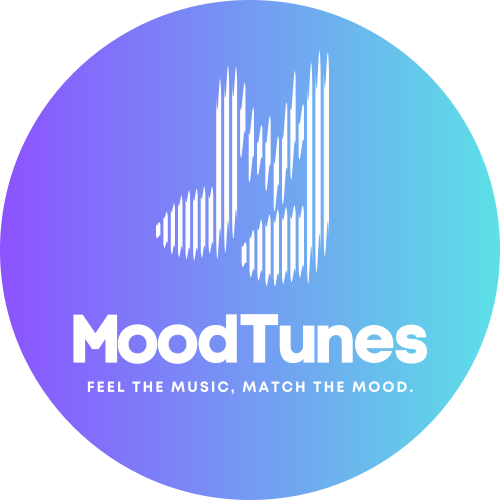

<div align="center">
   
  
   # MoodTunes 
   ## AI-Powered Mood-Based Music Recommender
   _A pure frontend experience that reads your vibe and instantly spins curated YouTube mini-playlists._
</div>

## 🪄 What changed?

- ✅ **Zero backend** – the entire experience now lives in React, so you only run `npm run dev`.
- ✅ **Face-to-vibe pipeline** – capture a selfie, let face-api.js read your expression, and jump straight into a matching playlist.
- ✅ **YouTube everywhere** – every track is an embedded YouTube player with mood-specific copy, gradients, and slick cards.
- ✅ **Music-app UI glow-up** – glassmorphic panels, gradient hero sections, and mood grids inspired by modern streaming apps.

## 🧰 Tech stack

- **React + Vite** for a buttery dev experience
- **Tailwind CSS 4** for rapid theming and gradients
- **Framer Motion** for subtle micro interactions
- **@vladmandic/face-api** loaded directly from CDN for on-device mood detection

No backend services, databases, or API keys are required.

## ✨ Feature highlights

| Feature | Details |
| --- | --- |
| 🎭 Face-powered moods | Real-time webcam feed → expression detection → mapped to curated vibes |
| 🎚️ Mood selector | Tap beautifully designed cards for Happy, Electric, Cloud Drift, Indigo, or Midnight playlists |
| 📺 Embedded playback | All songs are official YouTube embeds with “Watch on YouTube” CTAs |
| 🪩 Music-app aesthetic | Sticky glass navbar, gradient hero, spotlight chips, and responsive grid layouts |

## 🚀 Getting started

```bash
git clone https://github.com/isatyamshivam/moodtunes.git
cd moodtunes
npm install
npm run dev
```

Open http://localhost:5173 and allow camera permissions for mood detection.

## 🧭 How to use

1. **Take a selfie** – the camera card loads pre-trained face-api models and detects the dominant expression.
2. **Pick a vibe (optional)** – mood cards let you jump straight to Golden Glow, Electric Rush, Cloud Drift, Indigo Haze, or Midnight Drive.
3. **Press play** – curated micro playlists (4 tracks each) appear with embedded YouTube players, vibe badges, and descriptive copy.

Everything runs locally in the browser—no accounts, tokens, or backend calls.

## 📦 Installation

```bash

# 1. Clone the repository:
   
   git clone [your-repository-url]
   cd moodtunes

# 2. Install dependencies:

   npm install

# 3. Start the development server:

   npm run dev

# 4. Open your browser and navigate to:

   http://localhost:5173

```

## 🎯 Usage

1. **Select Your Mood:**
   - Take a selfie for automatic mood detection
   - Or manually select your current mood

2. **Explore Music:**
   - Browse through mood-specific playlists
   - Watch and listen to songs directly in the app
   - View detailed song information

3. **Switch Moods:**
   - Change your mood selection anytime
   - Get new playlist recommendations

## 💡 Key Components

- `App.jsx` – hero section, mood selector grid, and playlist routing
- `SelfieCapture.jsx` – webcam access + face-api detection + mood mapping
- `MoodSelector.jsx` – gradient cards powered by shared mood metadata
- `PlaylistGrid.jsx` – mood hero card + responsive YouTube card grid
- `PlaylistCard.jsx` – glassmorphic track card with embedded iframe
- `src/data/moods.js` – single source of truth for moods and curated tracks

## 📄 License

This project is open source and available under the [MIT License](LICENSE).

## 🙏 Acknowledgments

- Face detection powered by [@vladmandic/face-api](https://github.com/vladmandic/face-api)
- Animations powered by [Framer Motion](https://www.framer.com/motion/)

---
